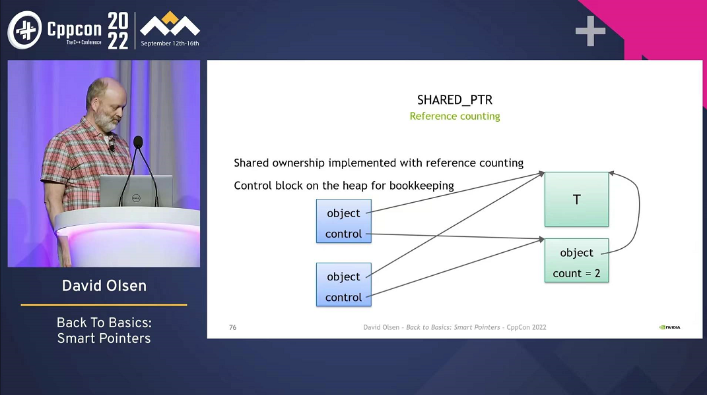
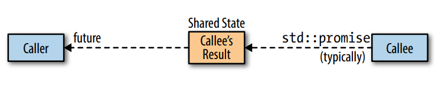

#  Effective Modern 读书笔记

---

# Deducing Types


## Item 1: Understand template type deduction

理解普通的 template 推导的基本概念

本节主要讲 template下 T、const T、T*、T&的理解


---

---


## Item 2: Understand auto type deduction

auto推导的基本概念

注意 auto x = {123} 得出的是 std::initializer_list<int>


---

---


## Item 3: Understand decltype

decltype的基本概念

推荐使用 decltype(auto) 在必要时当函数返回值


---

---


## Item 4: Know how to view deduced types

> 根据 IDE 的智能提示

> 使用编译器报错，来提供信息
>
> ```cpp
> template<typename T>
> class TD;
> 
> TD<decltype(xx)> xx_type;
> // 编译得出带有 xx类型的 报错信息
> ```

> typeid(x).name()

> boost::typeindex::type_id_with_cvr<decltype(xx)>().pretty_name()


---

---


# auto


## Item 5: Prefer auto to explicit type declarations

可以尽可能地在不影响阅读代码的情况下使用 auto


---

---


## Item 6: Use the explicit typed initializer idiom when auto deduces undesired types

补充了一下一些使用 auto 会导致额外问题的地方

尽量避免隐式转换，可以通过 static_cast<>() 去显示指定想要的类型


---

---


# Moving to Modern C++


## Item 7: Distinguish between () and {} when creating objects

说明了 {} 初始化的好处，但是对于有 std::initializer_list<T> 的构造函数，会有一些问题需要注意


---

---


## Item 8: Prefer nullptr to 0 and NULL

nullptr 是 可以转换成任何类型的 std::nullptr_t，可以尽可能使用


---

---


## Item 9: Prefer alias declarations to typedefs

尽可能用 using 而不是 typedef，using对模板元编程有很好的支持


---

---


## Item 10: Prefer scoped enums to unscoped enums

enum class 限定作用域的好处:

- 降低命名空间污染

- 不会隐式转换，需要时可以static_cast<T> 转为想要的值

- 默认可以前置声明 (enum前置声明的话需要指定低层类型)

enum class 低层默认是int

---

非限定 enum 使用场景: 需要编译期常量时

```cpp
std::tuple<int,int,int> tp;
enum InfoFields{ kNum1, kNum2, kNum3};
auto val = std::get<kNum2>(tp);
```


---

---


## Item 11: Prefer deleted functions to private undefined ones

尽可能使用 delete 去删除函数，而不是传统的 放入priavte而不实现函数

将要被delete的函数放在public下能更好地得到错误信息

可以删除重载函数去防止隐式转换

```cpp
void myFunc(int val);
void myFunc(char) = delete;		// 拒绝char
void myFunc(double) = delete;	// 拒绝double和float
```

可以阻止不应该进行的模板实现

```cpp
class Widget{
public:  
    template<typename T>
    void processPointer(T* ptr)
    {...}
};

template<>
void Widget::processPointer<void>(void*) = delete;
```


---

---


## Item 12: Declare overriding functions override

给派生类虚函数 override 时加上override关键字可以避免很多错误

override为语境关键字，尽在成员函数声明的末尾时才有override的意义

---

注意成员函数的引用饰词(reference qualifier)

```cpp
class Widget{
public:
    void doWork() &;	// *this为左值时调用
    void doWork() &&;	// *this为右值时调用
};
```


---

---


## Item 13: Prefer const_iterators to iterators

 尽可能使用 const_iterator 代替 iterator，理由同 const


---

---


## Item 14: Declare functions noexcept if they won't emit exceptions

如果函数接口保证不抛出异常，就加上 noexcept 去优化。并对外说明该函数的noexcept性质

大多数函数是异常中立的，不具备noexcept性质


---

---


## Item 15: Use constexpr whenever possible

constexpr对象在编译期就已经值初始化，并且该对象是const的

constexpr函数在参数都是编译期常量时染回编译期结果，如果有运行期变量、参数，则退化为普通的const

尽可能使用constexpr，可以提升到一个更广阔的作用域


---

---


## Item 16: Make const member functions thread safe

如果成员函数是const性质的，记得保证它的线程安全，不然可能不同的线程对同一个对象操作成员函数时，其mutable成员会 data race

---

如果是对 单个要求同步的 变量 或 内存区域，使用std::atomic就够了，如果是多个变量作为一个整体单位，就需要mutex了


---

---


## Item 17: Understand special member function generation


当基类析构函数是虚函数时，派生类默认的析构函数才会同样是虚函数

---

对于默认的移动构造、移动赋值：对支持移动操作的成员进行移动，对不支持移动的成员进行复制

---

复制函数彼此独立，而移动函数不同，声明了一个后编译器不会提供另外一个

---

显示声明了复制操作，就不会生成移动操作了

显示声明了移动操作，会delete编译器的复制操作

显示声明了析构函数，就不会生成移动操作

---

显示指定default能更好地扩展代码，和更好的可读性

```cpp
class Base{
public:
    virtual ~Base()          = default;
    Base(Base&&) 			= default;
    Base& operator=(Base&&)	 = default;
    Base(const Base&)        = default;
    Base& Base(const Base&)  = default;
};
```


---

---


# Smart Pointer


## Item 18: Use std::unique_ptr for exclusive-ownership resource management ( unique_ptr )

```cpp
// unique_ptr declaration in #include <memory>
template <class _Ty>
struct default_delete;
template <class _Ty, class _Dx = default_delete<_Ty>>
class unique_ptr;
```

**std::unique_ptr**很小巧，在没有设置删除器的情况下大小和裸指针一样

成员函数是 _Compressed_pair，是通过模板特化使其在默认情况下大小和裸指针一样的手段；如果使用默认删除器，则通过让自己继承空类的删除器来节省空间。

如果使用了自定义删除器，_Compressed_pair的成员变量为

```cpp
template <class _Ty1, class _Ty2>
class _Compressed_pair<_Ty1, _Ty2, false> final { // store a pair of values, not deriving from first
public:
    _Ty1 _Myval1;
    _Ty2 _Myval2;
}
```


---

---


## Item 19: Use std::shared_ptr for shared-owership resource ( shared_ptr )

**std::shared_ptr**的尺寸是裸指针的两倍，对应两个低层指针，一个指向所管理的资源，另一个指向该资源的引用计数**控制块**(ref_count)

shd::shared_ptr引用计数操作必须是原子的，而std::shared_ptr也常用于多线程环境

---

引用计数控制块中包含的信息：引用计数、弱计数、其他数据如自定义删除器

> 控制块的创建规则：
>
> - std::make_shared
> - 裸指针/unique_ptr作为实参时

控制块的析构会用到虚函数



---

std::enable_shared_from_this<T> 和 shared_from_this()


---

---


## Item 20: Use std::weak_ptr for std::shared_ptr-like pointers that can dangle ( weak_ptr )

**std::weak_ptr**主要拿来当观察者和缓存用，用来实时判断shared_ptr的资源是否还在的同时，不用肩负shared_ptr的责任

std::weak_ptr 和 std::shared_ptr的大小尺寸相同，内部成员指向同样的控制块，而 weak_ptr主要是指向控制块的第二个引用计数(弱计数)


---

---


## Item 21: Prefer std::make_unique/shared to direct use of new

使用 std::make系列的好处：

- 代码更加简洁
- 有更好的异常安全
- 有更好的性能

缺点：

- 不能使用自定义析构器
- 不能使用 {} 构造（可以通过 auto initList = {10,20} 这样来绕开）
- 不匹配自定义版本的 operator new / operator delete类对象

---

std::make_shared还有比较严重的缺陷，就是在其申请内存时，是托管对象资源连带控制块一同分配，虽然带来分配性能上的优势，但是如果存在比shared_ptr生命周期更长的weak_ptr，因为托管对象资源连带控制块，而weak_ptr持有控制块，这会导致shared_ptr全都析构了，但是有weak_ptr还在，使托管对象资源知道weak_ptr销毁时才销毁，如果托管对象资源很大，这会造成不小的影响


---

---


## Item 22: When using the Pimpl Idiom, define special member functions in the implementation file

当用**std::unique_ptr**去实现 Pimpl时，会因为std::unique_ptr在析构时会**static_assert**去确保裸指针不是非完整类型，那么Pimpl就有问题了，可以通过在实现文件中将析构啊，移动啊什么的都定义一遍解决该问题

```cpp
// widget.h
class Widget{
public:
    ...
    ~Widget();
    Widget(const Widget& rhs);
    Widget& operator=(const Widget& rhs);
    Widget(Widget&& rhs);
    Widget& operator=(Widget&& rhs);
};

// widget.cpp
Widget::~Widget() = default;
Widget::Widget(const Widget& rhs) = default;
Widget& Widget::operator=(const Widget& rhs) = default;
Widget::Widget(Widget&& rhs) = default;
Widget& Widget::operator=(Widget&& rhs) = default;
```

可以使用**std::shared_ptr**避免类似问题，不过会相应带来一点空间消耗


----

----


#  Rvalue References, Move Semantics, and Perfect Forwarding


## Item 23: Understand std::move and std::forward

**std::move**的本质是类型转换，但是不能保证经过move后的对象一定具备可移动能力(move常量对象)

```cpp
template<typename T>
decltype(auto) move (T&& param){
    using ReturnType = remove_reference_t<T>&&;
    return static_cast<ReturnType>(param);
}
```

如果想取得对某个对象执行移动操作的能力，则不要将其声明为常量，因为针对常量对象执行的移动操作将变换为复制操作

```cpp
void func(const std::string str){
    std::string text = std::move(str);
    // 这里给text赋值用的是复制而不是移动
    // 因为str是const，move后仍具const性质，不支持移动操作
}
```

---

**std::forward**的本质也是类型转换，通过引用折叠去转发参数原本的性质(左右值)

```cpp
template<typename T>
T&& forward(remove_reference_t<T>& param){
    return static_cast<T&&>(param);
}
```


---

---


## Item 24: Distinguish universal references from rvalue references

万能引用的低层实现是引用折叠

```cpp
// 万能引用
template<T>
void func(T&& param);

auto&& val2 = val1;
```

一些区分万能引用和右值引用的例子：

- ```cpp
  template<typename T>
  void func(std::vector<T>&& param);
  // 只是 vector的右值引用
  ```

- ```cpp
  template<typename T>
  void func(const T&& param);
  // 只有纯的 "T&&" 才是万能引用
  // 这里因为 const 的影响，所以是 右值引用
  ```

- ```cpp
  template<class T,class Allocator = allocator<T>>
  class vector{
  public:
      void push_back(T&& x);
      // 这里是 右值引用 而不是 万能引用
      // 因为 T在指定 vector 类型时就确定了，没有类型推导
      
      template<class... Args>
      void emplace_back(Args&&... args);
      // 这里就是 万能引用了
      // 因为这里存在类型推导
  };
  ```

- ```cpp
  // lambda 中使用 万能引用
  auto timeFuncInvocation = 
      [](auto&& func,auto&&... params){
    std::forward<decltype(func)>(func)(
        std::forward<decltype(params)>(params)...
    );
  };
  ```


---

---


## Item 25: Use std::move on rvalue references, std::forward on universal references

针对右值引用的最后一次才实施std::move

针对万能引用的最后一次才实施std::forward

---

不要对局部对象作为返回值时std::move/std::forward，这样不能给编译器带来优化，甚至会影响 RVO(return value optimization)的编译器优化


---

---


## Item 26: Avoid overloading on universal references

如果万能引用存在重载，它会吸引走大批的实参型别，会导致很多麻烦的问题，以下是一个例子

```cpp
std::multiset<std::string> g_names;
    
template<typename T>
void logAndAdd(T&& name){
    do_some_log();
    g_names.emplace_back(std::forward<T>(name));
}

// 如果存在一个int类型的重载
std::string nameFromIdx(int idx); // 根据idx返回name
void logAndAdd(int idx){
    do_some_log();
    g_names.emplace_back(nameFromIdx(idx));
}
```

对于上述例子，如果传入的是 short/long 等，会调用万能引用的重载，因为精确匹配优先于提升后的匹配，这会导致调用错误

---

以下是另一个例子

```cpp
class Person{
public:
    template<typename T>
    explicit Person(T&& n) : name(std::forward<T>(n)){}
    explicit Person(int idx);
};

// 情况一
Person p("kiqsont");
auto cloneOfP(p);
// 这里会调用万能引用的构造函数
// 因为 Person(Person& n) 精确于 Person(const Person&)

// 情况二
class SpecialPerson : public Person{
public:
    SpecialPerson(const SpecialPerson& rhs)
        :Person(rhs){} // 这里调用 Person的万能引用构造
    // move 也是调用Person的万能引用构造
};
```

注意 万能引用函数的重载 与 构造函数是万能引用 的情况，很容易出现问题

---

---

## Item 27: Familiarize yourself with alternatives to overloading on universal references

这个条款是讨论 Item26例子 中的解决手段

**舍弃重载**

**使用老方法 const T& 而不是万能引用**

**不用万能引用去避开左右值，而是直接用值传递**

```cpp
class Person{
public:
    explicit Person(std::string n) : name(std::move(n)){}
};
```

---

使用 meta-programming 手法

**标签分派**

给 logAndAdd再封装一层，加入分别对 integral 和 其他万能引用 的重载

```cpp
template<typename T>
void logAndAdd(T&& name){
    do_some_log();
    logAndAddImpl(
    	std::forward<T>(name),
        std::is_integral<std::remove_reference_t<T>>()
    )
}

template<typename T>
void logAndAddImpl(T&& name,std::false_type){
    g_names.emplace_back(std::forward<T>(name));
}

void logAndAddImpl(int idx,std::true_type);
```


**enable_if 进行模板限制**

```cpp
class Person{
public:
  template<typename T,
    typename = std::enbale_if_t<
        !is_base_of<Person,std::decay_t<T>>::value
        &&
        !std::is_integral<std::remove_reference_t<T>>::value
            >>
  explicit Person(T&& n);
};
```

如果使用这种方式，会导致出错时报错很难看得懂

具有性能优势，但是易用性下降了很多


万能引用转发的次数越多，报错的错误信息就越难看懂


---

---


## Item 28: Understand reference collapsing

对于万能引用推导，左值会推导为T&，然后T& &&折叠为T&，右值会推导为T，然后变成T &&

引用折叠发生的语境：模板实例化、auto型别推导、创建和运用typedef和using，decltype


---

---


## Item 29: Assume that move operations are not present, not cheap, and not used

移动语义不太好用的场景：

- 待移动对象未提供移动操作，移动会变为复制
- 移动不可用，如果移动操作为指定为 noexcept，移动会变得不可使用
- 移动有时候未必更快，例如 std::string 存小型字符串时，会用SSO(small string optimization)机制，将字符串存在内部缓存区里而不是堆上，此时复制会比移动快


---

---


## Item 30: Familiarize yourself with perfect forwarding  failure cases

**完美转发失败的定义**

- 模板类型推导失败
- 推导结果是错误类型

例如：

```cpp
template<typename T>
void fwd(T&& param){
    f(std::forward<T>(param));
}

 f ( expression );
fwd( expression );
// 以上两个调用的结果不一致，则说明完美转发失败
```

---

失败的情况：

**大括号初始化**

```cpp
void f(const std::vector<int>& v);
f({1,2,3});
fwd({1,2,3});	// 编译报错

// 因为 fwd的形参未声明为std::initializer_list
// 编译器禁止了此次推导

auto il = {1,2,3};
fwd(il);
// 可以通过这样去绕开
```

---

**0 和 NULL**

0和NULL 一般会推导为 int，这就导致了作为空指针时不能完美转发，可以通过nullptr来避免此情况

---

**整形static const成员变量**

如果像 static const std::size_t 这样的成员变量只有声明没有定义，编译器会进行将这个值替换成对应的整数，所以无法对此进行取地址操作，同时也不能支持完美转发，解决方法是提供定义

---

**重载的函数名字和模板名字**

```cpp
int func(int);
int func(int,int);

void f(int f(int));
f(func);	// 编译成功
fwd(func);	// 编译失败，无法指定具体的函数

// 可以进行类型转换去避免
using funcType = int(*)(int);
fwd(static_cast<funcType>(func));	// 编译成功
```

---

**位域**

非const引用不得绑定到位域，而 fwd 的形参是个引用

```cpp
struct IPv4Header{
    std::unit32_t version:4,
    			 IHL:4,
    			 DSCP:6,
    			 ECN:2,
                  totalLength:16;   
};

f(h.totalLength);
fwd(h.totalLength);	//编译失败

// 可以通脱值复制进行避免
auto len = static_cast<std::uint16_t>(h.length);
fwd(len);
```


---

---


# Lambda Expression


## Item 31: Avoid default capture modes

小心默认捕获导致空悬指针/引用，特别是异步编程时捕获了this

显示地列出 lambda所需要捕获的局部变量/形参 是更好的编程实践习惯


---

---


## Item 32: Use init capture to move objects into closures

在C++14后，有了lambda的广义捕获，可以移动地捕获对象，而在C++11时可以通过bind去模拟

```cpp
std::string x = "hello c++ ";
auto foo = [x = std::move(x)]{ return x + "world"; };
```


---

---


## Item 33: Use decltype on auto&& parameters to std::forward them

lambda的模板用法

```cpp
auto f = 
    [](auto&& param){
    	// call func in template lambda
    	func(std::forward<decltype(param)>(param));
}
```

---

在C++20之后，支持lambda的template使用

```cpp
auto f = []<typename T>(T const& x){
    T copyObj = x;
    using Iterator = typename T::iterator;
}

// before C++20
auto f = [](const auto& x){
    using T = std::decay_t<decltype(x)>;
    T copyOb...
}
```


---

---


## Item 34: Prefer lambdas to std::bind

**lambda** 比 **std::bind** 更加强大，有更好的可读性，而且更易维护

除了C++14以前对lambda的支持不是太好，部分地方需要使用bind去实现，C++14及之后的lambda有很强大的功能，可以全方位优于bind


---

---


## lambda Supplement

在异步编程时，如果捕获this，很可能会发生空悬，可以通过将整个类复制捕获进lambda

```cpp
[*this](){}
```

在捕获时最好指明 this的捕获方式是this还是*this

```cpp
[=,this]{}
```


---

---


# The Concurrency API


## Item 35: Prefer task-based programming to thread-based

**std::async**的好处：

- 能够较好处理异步线程函数中抛出的异常。如果 std::thread(func)，而func抛出异常，那么程序会死到(通常是调用std::terminate)，而std::async返回一个future，调用std::async的线程能通过get访问到异常
- 将线程管理转交给系统调度器，在线程资源不够时，std::thread创建线程会失败，而std::async默认策略可以被调度器负载均衡，根据资源情况，选择异步/同步执行std::async的函数

---

需要使用**std::thread**的情况：

- 需要访问低层线程API，如std::thread有成员函数native_handle能访问低层线程API
- 有能力优化线程时，如果程序运行在固定的机器上，可以根据机器配置去定制线程策略
- 实现一些工具，如线程池


---

---


## Item 36: Specify std::launch::async if asynchronicity is essential

std::async的默认策略可以很好地配合线程的负载均衡，但同时也引发一些问题，如果不调用std::async返回的std::future的wait()/get()，那std::async对应的函数可能不会调用

以默认策略使用std::async的条件：

- 任务不需要与调用get/wait的线程并发执行

- read/write任意线程的thread_local变量没有影响

- 保证能调用get()/wait()，或者接收任务不运行的情况

- ```cpp
  auto fut = std::async(func);
  if(fut.wait_for(0s) == std::future_status::defered)
  {
      ...
  } else {
      while(fut.wait_for(100ms)!= std::future_status::ready){
          ... // 等待fut就绪
      }
      ... // fut就绪
  }
  ```

  使用wait_for()/wait_until()时要将任务被推迟的情况考虑进去

  

  必要时指定std::async的运行策略

  

  ---

  ---

  

  ## Item 37: Make std::threads unjoinable on all paths

  std::thread对象对应的底层线程若处于阻塞/等待调度，那么它是 可联结的(joinable) 的

  

  std::thread不可联结的情况：

  - 默认构造后的std::thread
  - 被移动后的std::thread
  - 已经join()的std::thread
  - 已经detach()的std::thread

  如果std::thread不可联结地走进其析构函数，那么程序会死掉


---

---


## Item 38: Be ware of varying thread handle destructor behavior

(没看懂这一章)

共享状态一般使用堆上对象表示



std::future指涉的共享状态是由调用std::async创建

对于未推迟任务，std::future析构会对低层任务线程隐式join()

对于其余任务，会隐式detach()


---

---


## Item 39: Consider void futures for one-shot event communication

如果"主线程"要等创建出来的thread才能继续往下跑，那通常情况需要std::mutex，std::condition_varbale，bool才能实现，有点浪费了，还有一种手段是通过future的wait进行等待

```cpp
std::promise<void> g_p;

void mainFunc(){
    std::thread aFunc([]{
        // 通知thread初始化完毕
        g_p.set_value();
        ...
    });
    
    // 进行等待
    auto sp = g_p.get_future().share();
    sp.wait();
    
    ...
    
    aFunc.join();
}
```


---

---


## Item 40: Use std::atomic for concurrency, volatile for special memory

std::atomic的写入操作对语句的乱序重排有限制作用，能保证所有赋值什么的时序不会改变

volatile能保证编译器不对其指定的变量进行优化

上面两个能够同时使用


---

---


# Tweaks(微调)


## Item 41: Consider pass by value for copyable parameters that are cheap to move and always copied

对于可复制，移动成本低廉并且一定会被复制的形参，可以考虑传值手法

```cpp
// 左右值引用
// 缺点：要同时维护两份代码，如果内联失败，则有实打实的两个函数
struct Widget{
    std::vector<std::string> m_names;
    void addName(const std::string& newName)
    { m_names.push_back(newName); }
    void addName(string&& newName)
    { m_names.push_back(std::move(newName)); }
};

// 万能引用
// 缺点：会导致头文件肿胀，而且传入参数错误，报错信息难读
struct Widget{
    std::vector<std::string> m_names;
    template<typename T>
    void addName(T&& newName)
    { m_names.push_back(std::forward<T>(newName)); }
};

// 按值传参
struct Widget{
    std::vector<std::string> m_names;
    void addName(std::string newName)
    { m_names.push_back(std::move(newNmae)); }
};
```

但具体情况还要具体分析，例如接受基类的引用/指针，就不能按值了


---

---


## Item 42: Consider emplacement instead of insertion

理论上，emplace比push效率更高，但是从实践角度，还需要进行实测才能得出结论

emplace比push效率高的几种情况：

- 如果传入的值是构造函数的参数
- 容器不太可能由于重复情况而拒绝添加的新值

---

对于智能指针，不应该将 "new Widget" 作为参数传给emplace，因为emplace不支持异常，而push能够为异常兜底

---

在使用emplace时，要小心传递的实参是否正确，因为emplace底层是sttd::forward，所以不能第一时间判断对象是否能根据实参构造成功
